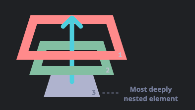

## 21. Describe event bubbling.


이벤트가 제일 하위 요소부터 시작해서 부모요소까지 올라가는 현상

**focus, focusout** 이벤트는 전파 X

이벤트 버블링을 이용해서 하위요소에 공통 이벤트를 적용하는 경우 다음과 같이 코드를 짤 수 있다.

```
<html>
<ul id="people">
    <li id="lee">lee</li>
    <li id="kim">kim</li>
</ul>
</html>

<script>
const $people = document.querySelector("#people");

$people.addEventListener('click', e => {
    // 버블링 전파를 막는 방법
    // e.stopPropagation();
    console.log('e.target.value', e.target.value);
});

</script>
```

```
<html>
<div class="first-cover">
  <ul class="second-cover">
    <li class="third-cover">
      <div class="last-el">event</div>
    </li>
  </ul>
</div>

<script>
$(".last-el").click(function(e){
	e.stopPropagation();
	alert("last-el");
});
$(".third-cover").click(function(){
	alert("third-cover");
});
$(".second-cover").click(function(){
	alert("second-cover");
});
$(".first-cover").click(function(){
	alert("first-cover");
});
</script>
</html>
```

## 22. What's the difference between an "attribute" and a "property"?

attribute: elements에 추가적인 정보를 넣을 때 사용한다.
property: html DOM안에서 attribute를 가리키는 표현이다.

https://medium.com/hexlant/attribute-%EC%99%80-property-%EC%9D%98-%EC%B0%A8%EC%9D%B4-c6f1c91ba91

## 23. Why is extending built-in JavaScript objects not a good idea?

내장 javascript 객체를 확장한다는 의미는 prototype에 프로퍼티와 메소드를 추가한다는 의미이다.
이것이 위험한 이유는 메소드나 프로퍼티를 추가하는 경우 기존에 있던 프로퍼티와 메소드를 덮어쓸 수 있기 때문이다.

```
const arr = [1,2,3];
arr.includes(1);// true
arr.includes = function() {
    console.log('1');
}
arr.includes("aa");//
```

## 24. Difference between document load event and document DOMContentLoaded event?

DOMContentLoaded 이벤트: HTML 문서 파싱 후 실행되는 이벤트
window의 load 이벤트: DOM과 모든 resource, asset이 로드 후 실행되는 이벤트

DOMContentLoaded로 함수를 호출하는 경우 js가 로드된 상태가 아니기 때문에 프로그램이 정상동작하지 않을 수 있다.

## 25. What is the difference between == and ===?

==: 추상 동등 연산자
===: 완전 동등 연산자

null과 undefined를 비교할 때 추상 동등 연산자를 사용할 수 있으며, 이외타입의 경우 완전 동등 연산자로 비교해야 에러가 발생하지 않는다.

```
console.log(1 == '1');// true
console.log(1 === '1');// false

console.log(1 == true);// true
console.log(1 === true);// false

console.log(0 == false);// true
console.log(0 == false);// false
```
